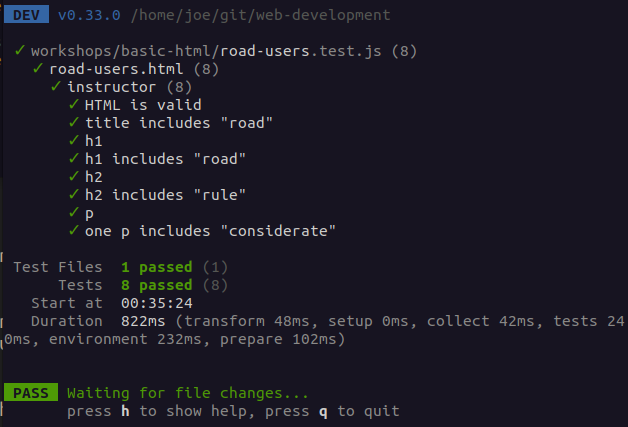

# Web Development and User Experience

This repository holds lecture notes, code examples, workshops, and
auto-markers for the corresponding MA module.

## Getting started

Are you new to GitHub? You may find what you need in the [GitHub Documentation](https://docs.github.com/).

## Viewing lectures and workshops

Try out the [http://birkbeck2.github.io/web-development](website) where
you can search and read the content more easily than via GitHub.

## Running auto-markers (for lecturers)

The auto-markers are written using [Vitest](https://vitest.dev/),
a user-friendly unit test framework in JavaScript from the makers of
Vue.js.

The tests are located in their corresponding workshop files, and there’s
one `test-utils.js` module that helps you run the tests on any
number of example or student repositories found in `answers`
subfolders. The test utils expect this structure:

```
.
└─ workshops
   └─ basic-html
      ├─ basic-html-instructions.md
      ├─ road-users.test.js                       // first part of filename should match file to test
      └─ submission                               // the contents of this folder are git-ignored
         ├─ web-development-basic-html-student1   // this can be a Git repository
         │  └─ road-users.html                    // this file will be tested
         ├─ web-development-basic-html-student2
         │  └─ road-users.html                    // this file will be tested too
         └─ web-development-basic-html-instructor // make a private/internal instructor repository
            │                                     // with correct submission, to test your tests
            └─ road-users.html                    // this file will be tested too
```

Here are all the instructor repositories, which are kept private so that students cannot see them:

- [web-development-basic-html-instructor](https://github.com/Birkbeck2/web-development-basic-html-instructor)

To run tests on all the matching files in `answers` subfolders, clone the repository, install dependencies, and run the test command:

```shell
npm install
npm run test
```

You should then see a summary in the terminal with the test results:



To run tests on
[Gradescope](https://gradescope-autograders.readthedocs.io/en/latest/),
create a zip file for each workshop using this script:

```shell
npm run zip
```

Then upload the zip file to the Gradescope assignment and check that it
has built the testing environment successfully.

## Rights

Lectures are copyright Birkbeck, University of London. Pictures and
workshop documents are copyright Birkbeck, University of London unless
otherwise stated where they are referenced in the lectures.

<a rel="license" href="http://creativecommons.org/licenses/by/4.0/">
  
</a>
<br>
This work is licensed under a <a rel="license" href="http://creativecommons.org/licenses/by/4.0/">Creative Commons Attribution 4.0 International License</a>.
