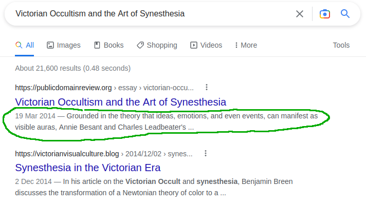
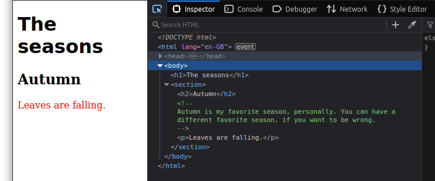

Web Development and User Experience | Coding Session 2 | Joseph Muller

[Previous](html-links-images-and-file-organization.md) | [All](README.md) | [Next](meaning-and-presentation-in-html.md)

# Behind-the-scenes HTML


_“Behind the scenes Photographer Levitation Magic [explore #496]” by Louish Pixel is licensed under [CC BY-NC-ND 2.0](https://creativecommons.org/licenses/by-nc-nd/2.0/?ref=openverse)._

Now that you know about attributes, you are ready to code some of the hidden, behind-the-scenes aspects of HTML.

For example, have you ever noticed that when you post a link to something on social media, or you send a link to a friend on a messenger app like WhatsApp, it automatically populates a box containing the title and description of the thing, along with a picture of it? 

Here's an example from WhatsApp:


How does it get there? It gets there because WhatsApp does some things behind the scenes that it doesn't show you. WhatsApp opens the link, loads the HTML document, and looks inside the HTML `head` element for information about what image, title, and description to use to represent that webpage inside WhatsApp.

This means that, as a web developer, you have to think about the instructions you give to third-party websites that link to your website. And the way you give those instructions has to do with attributes inside special elements in the `head` element.


## Your web page on social media and in search results

Let's get into this by looking through the `head` element. Let's say we are marking up an article called “Victorian Occultism and the Art of Synesthesia.”

### Meta tags
HTML gives you a special way to communicate metadata about your page, the `meta` tag. This stands for *metadata*, which is data about the document.

Note that `meta` is a self-closing tag--it doesn't wrap text, it's just there to hold the data in its main (“opening”) tag.

Most of the time, you only need to put `meta` tags in the head of your page.

### Title
We already know one thing that goes into the `head`, the `title`.

```html
<!DOCTYPE html>
<html lang="en-GB">
    <head>
        <title>Victorian Occultism and the Art of Synesthesia</title>
    </head>
    <body>
    </body>
</html>
```

The title element does *not* render in the main webpage window of the browser.

The title *does* render in the browser tab.


It also renders in the social media card or browser search result for that webpage.


### Description

You can enter a description of your website that search engines will use in search results. Entering a good description using the key words from your page will dramatically enhance the search engine optimization (SEO) of your website.

*In `https://publicdomainreview.org/essay/victorian-occultism-and-the-art-of-synesthesia`:*

```html
<meta name="description" content="Grounded in the theory that ideas, emotions, and even events, can manifest as visible auras, Annie Besant and Charles Leadbeater’s <em>Thought-Forms</em> (1901) is an odd and intriguing work. Benjamin Breen explores these “synesthetic” abstractions and asks to what extent they, and the Victorian mysticism of which they were born, influenced the Modernist movement that flourished in the following decades.">
```

Note that the description is entered using the `meta` element with two attributes, one for the name of the piece of metadata (`name`), and the other for the value (`content`).

Here's how it looks:




### Images

You can tell social media websites and messenger apps what image to show when people link to your site.

You use the same `meta` element, but a slightly different set of attributes.

For Facebook, WhatsApp, and many others, you use `property` instead of `name` to give the name of the piece of metadata, because this convention came about through the development of a different standard than HTML, the [Open Graph protocol](https://ogp.me/).

You also include `og:` in the value of the `property` attribute to differentiate it from other standards that might use similar values. (This is called a _namespace._)

```html
<meta
    property="og:image"
    content="https://the-public-domain-review.imgix.net/essays/victorian-occultism-and-the-art-of-synesthesia/thoughtformsthumb.jpg"
    alt="Colorful drawn shapes ripple outward above a cathedral in a field"
>
```

For Twitter, you use `name` and `content`, but you include `twitter:` inside the value.
```html
<meta
    name="twitter:image"
    content="https://the-public-domain-review.imgix.net/essays/victorian-occultism-and-the-art-of-synesthesia/thoughtformsthumb.jpg"
    alt="Colorful drawn shapes ripple outward above a cathedral in a field"
>
```

As with any image, you include alt text.


As you can see, a lot of this code isn't behind the scenes at all, when your website goes live. In fact, in the case of the title, description, and social media photo, this might be the first thing that users will see when they encounter your content via a search or a share, so it's important not to forget about it.

### Check your understanding
1. If somebody posts a link to the page below in a group on WhatsApp, what will the post look like in WhatsApp? Let's say the URL is `https://www.example.org/leaves/index.html`.

```html
<html lang="en">
    <head>
    </head>
    <body>
        
    </body>
</html>
```

<!-- It will just be the URL, no image, no title, no description, because that info is missing in the head. -->

## Other `head` elements to know about

There is a lot more that web developers put inside the `head` element to give the web browser information about how to load it.

### Character encoding

How does HTML handle languages? In addition to declaring the language of a document with something like `<html lang="en">`, you should declare the *character encoding*.

Character encoding is a very technical piece of information related to how the computer makes the symbols of text on the page, and it influences how well your webpage can hold text in many world languages.

As an example, consider the [Wikipedia article for Arabic, in Arabic](https://ar.wikipedia.org/wiki/%D8%A7%D9%84%D9%84%D8%BA%D8%A9_%D8%A7%D9%84%D8%B9%D8%B1%D8%A8%D9%8A%D8%A9):


In the early days of HTML, it would have been very difficult to create this webpage, because the sybmols needed were not included in the character set they used.

Web developers were very Euro- and US-centric in the beginning, so the early character encoding standard, the American Standard Code for Information Interchange (ASCII), just included the letters, numbers, and punctuation needed in English and a few other European languages.

But modern web developers use a form of encoding called [Unicode](https://home.unicode.org/), which supports nearly all the languages of the world.

The Arabic-language article on Wikipedia uses Unicode, as does the [English-language article](https://en.wikipedia.org/wiki/Arabic).

Unicode is now generally the best choice for every world language, and you should always use it unless you have a very good reason to use a different one.

Unicode character encoding is most commonly declared as "utf-8" or "UTF-8", and using a `meta` element with attribute `charset`.

```html
<meta charset="utf-8">
```

You just need to add this line inside the `head` element of each HTML file.

### Style
Styling information is also something that you put in the HTML `head`.

The first way to put style in the head is by wrapping CSS code with the `style` element:

```html
<head>
    <style>
        p { color: red; }
        h2 { font-family: sans-serif; }
    </style>
</head>
<body>
    <h2>Autumn</h2>
    <p>Leaves are falling.</p>
</body>
```


The second way to put style in the head is to refer to an external CSS file with a `link` element. This is usually better because it keeps things organized and maintains the separation of content and style.

Files:

```
index.html
images/
    leaf.png
styles/
    main.css
```

In `index.html`:

```html
<head>
    <link rel="stylesheet" href="styles/main.css">
</head>
<body>
    <h2>Autumn</h2>
    <p>Leaves are falling.</p>
</body>
```

In `main.css`:

```css
p { color: red; }
h2 { font-family: sans-serif; }
```


While we're on style, you need to know about one other way to include CSS in HTML. Instead of declaring it in the head, you include CSS code as the value of the `style` *attribute* of the element you're trying to style:

```html
<body>
    <h2 style="font-family: sans-serif;">Autumn</h2>
    <p style="color: red;">Leaves are falling.</p>
</body>
```


This is called in-line CSS. It is the easy-at-first, nightmarish-in-the-end way of doing CSS. It's nice when you only have two lines of HTML, because you don't have to save a separate file or use CSS selectors (i.e. element names).

But beware! You will regret it when your website gets bigger, or when you have to change the same CSS code on 16 different `div` tags, three separate times over the course of your project.

### Scripts

The `script` element works just like the `style` element, except it wraps *JavaScript* code.

```html
<head>
    <script>
        alert("Hello!");
    </script>
</head>
```

You can also import JavaScript from a separate file. But rather than use a `link` element like you do with CSS, you use `script` with a `src` attribute:

Files:

```
index.html
scripts/
    main.js
```

In `index.html`:

```html
<head>
    <script src="scripts/main.js" defer></script>
</head>
```

In `main.js`:

```js
alert("Hello!");
```

Here's what the JavaScript does when the page is loaded:


Note the `defer` attribute on the `script` element. This tells the browser to wait until all the HTML is loaded before running the JavaScript file, boosting performance.

(This attribute only requires its name (no `="some value"`) because it uses the Boolean data type (true or false).)

## Putting the `head` together

Here are all these elements put together.

```html
<!DOCTYPE html>
<html lang="en-GB">
    <head>
        <meta charset="utf-8">
        <title>The Seasons</title>
        <meta
            name="description"
            content="The seasons are described in terse, overly structured banalities"
        >
        <meta
            property="og:image"
            content="images/leaf-shed-in-autumn.png"
            alt="A light brown maple leaf spread out on a white background"
        >
        <meta
            name="twitter:image"
            content="images/leaf-shed-in-autumn.png"
            alt="A light brown maple leaf spread out on a white background"
        >
        <link rel="stylesheet" href="styles/main.css">
        <script src="scripts/main.js" defer></script>
    </head>
    <body>
        <h1>The seasons</h1>
        <section>
            <h2>Autumn</h2>
            <p>Leaves are falling.</p>
        </section>
    </body>
</html>
```

### Check your understanding
Would this work?
```html
<link src="stylesheet" content="styles/main.css">
```

<!--
No. Link needs rel not src, and href not content
-->

## Hiding in the `body`

Not done being sneaky? There are ways to hide things in the `body` as well.

### Comments
As you write HTML code, you may need to write notes for yourself or other humans who will read it.

HTML provides a way to embed comments into your HTML files without rendering them in the browser.

```html
<h2>Autumn</h2>
<!-- Autumn is my favorite season, personally.
You can have a different favorite season,
if you want to be wrong. -->
<p>Leaves are falling.</p>
```

Comments open with a `<!--` and close with `-->`, and they can span multiple lines.

They are not rendered for the user, but they are visible in the code inspector.



### The `hidden` attribute

You can also just make things disappear with an attribute called `hidden`.

```html
<h2>Autumn</h2>
<p>Leaves are falling.</p>
<p hidden>Or disappearing.</p>
```

This one is useful for hiding elements at first until they are called up by user interactivity, or for including data in a web form.

Until you know how to do that, you may just find it useful to set some parts of your code to the side while you work on and test out other parts.

## References
“What's in the head? Metadata in HTML, Mozilla Developer Network, last modified October 4, 2022, [https://developer.mozilla.org/en-US/docs/Learn/HTML/Introduction_to_HTML/The_head_metadata_in_HTML](https://developer.mozilla.org/en-US/docs/Learn/HTML/Introduction_to_HTML/The_head_metadata_in_HTML).

<a name="breen"></a>Benjamin Breen, “Victorian Occultism and the Art of Synesthesia,” _The Public Domain Review_, March 19, 2014, [https://publicdomainreview.org/essay/victorian-occultism-and-the-art-of-synesthesia](https://publicdomainreview.org/essay/victorian-occultism-and-the-art-of-synesthesia). This article was originally published in The Public Domain Review under a Creative Commons Attribution-ShareAlike 3.0. If you wish to reuse it please see [publicdomainreview.org/legal](https://publicdomainreview.org/legal/).

*HTML: The Living Standard: Edition for Web Developers,* last updated September 28, 2022, https://html.spec.whatwg.org/dev/.

## Rights
Copyright Birkbeck, University of London

<a rel="license" href="http://creativecommons.org/licenses/by/4.0/"></a><br />This work is licensed under a <a rel="license" href="http://creativecommons.org/licenses/by/4.0/">Creative Commons Attribution 4.0 International License</a>.
