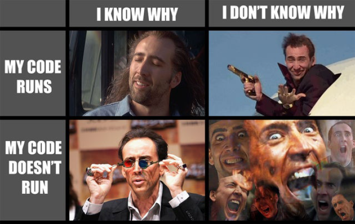
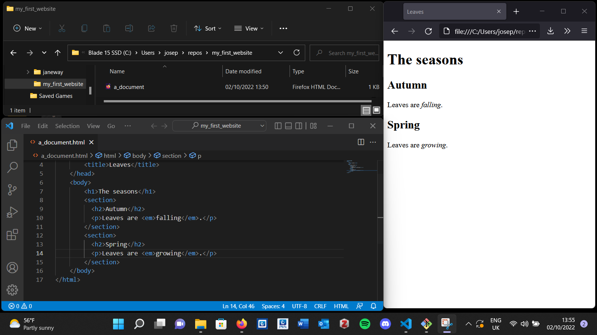

Web Development and User Experience | Coding Session 1 | Joseph Muller

[Previous](how-the-internet-works.md) | [All](README.md) | [Next](workshop-1.md)

# Code editors and environments

There are a lot of different ways to edit text and save it. You can use Microsoft Word, Google Docs, the Notes app on your phone, or Gmail.

But these won't work for writing HTML, because they are too smart and helpful, and they aren't literal enough. To write HTML, you need an application that
1. lets you edit plain text, controlling every symbol and letter in the file, and
2. lets you control file names and where files are saved.

Most laptop or desktop computer operating systems have a default text editor (Windows Notepad, Apple TextEdit). You can use these, but they are bare-bones. They lack helpful features that make writing code easier and more pleasant:

- syntax highlighting
- syntax checkers
- file tree panes
- themes
- style hints
- version control tool integration

## Choosing a code editor

You can choose any code editor you want, but it must allow you to edit files at the plain text level and control how they are saved.

If you don't already have one you like, we recommend Visual Studio Code (VS Code).

VS Code is a leading code editor available on all operating systems. It is highly extensible and well-supported.

Other options to check out include Atom (though it is not being actively developed any more) and Sublime.

## Making a development environment

Your development environment is the combination of:

- Your computer and operating system
- Your code editor
- The file tree in which your code is saved
- The application you use to run your code and see the result (web browser or terminal)
- Version control systems (covered later this term)
- Environment variables (not covered this term)
- Installed software required for your code to run (not covered this term)

Finding a development environment that gives you all the tools to write, test, and debug your code is essential to your skill as a coder.

## A simple example environment

Here's how you might want to arrange things on your screen to start out.

- Windows File Explorer or Mac Finder in the background
- VS Code or another code editor on the left
- Firefox or your preferred browser on the right

With this environment, I can control files and folders, write code, and see the output of the code in the browser.

Wait a minute! How is the website running on my computer?

## Running websites on your computer with no internet
Recall the parts of a URL: “scheme”, “host”, and “path”. 

The scheme tells the browser how to process the URL. When you are actively developing a website, you use a different scheme and host than the finished website will use.

You use the “file” scheme, which tells the browser to look locally for a file rather than sending an HTTPS request to the DNS server. (If you open the developer tools and watch the network activity, you will see none when the page loads.) The internet can be completely disconnected when you do this and it will still work.

Where's the “host”? It's empty in this case. The “file” scheme doesn't need a host because your computer is the host!

That leaves the path. The path is evaluated locally against your computer's folders and files.

## Choosing a folder for your coding projects
As you can see, the place where your code will live is an important part of web development. The folder you put code in will determine its path.

The folder you designate should
- sit high up in your computer hierarchy so the URL you type isn't super long,
- have no spaces (ideally) because these can cause problems, and
- should not be inside Google Drive or another cloud storage service, as this might interfere with the version control system we will introduce later.

Here are some example paths:

- `C:\Users\username\coding` (Windows)
- `/Users/username/coding` (Mac)
- `/users/username/coding` (Linux)

Note that Windows uses backslashes in the file structure, but Mac, Linux, and URLs use forward slashes.

## Inspecting your own code
Recall the developer tools, and the inspector pane. This is one of the best ways to check how the browser read your code.

Use the element picker to look at the interpreted HTML underlying each part of the rendered page.

## Credits
Antonio Daniele created the precursor to this lecture for Birkbeck's MA in Digital Media Design in academic year 2021-22.

## Rights
Copyright Birkbeck, University of London

 This work is licensed under a <a rel="license" href="http://creativecommons.org/licenses/by/4.0/">Creative Commons Attribution 4.0 International License</a>.
