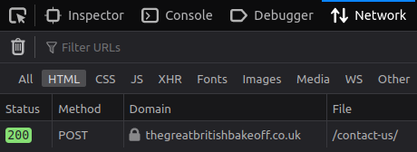
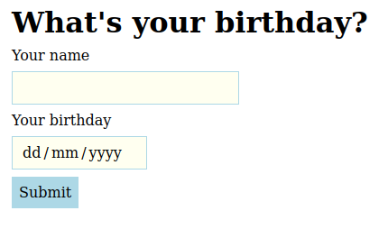

Web Development and User Experience | Coding Session 2 | Joseph Muller

[Previous](will-it-work-using-sandboxes-to-test-code.md) | [All](README.md) | [Next](html-page-structures.md)

# HTML forms

So far we have covered how to present information on a webpage.

What if you want to collect information from visitors? This could be text they type into a field, a selection they make from options you give them, or even the click of a button.

HTML provides the `form` element for all of these use cases.

## GET and POST request methods

To use forms effectively, you need to know about HTTP request methods, which are ways the client browser categorizes the requests it makes to the server.

You've already been writing web pages that use one of these methods, the GET method.

The GET method is just for getting information from the server, not for sending information to the server.

Whenever you ask a webpage to load for the first time, the browser sends a GET request.

Another example of a GET method: you have a button that filters down a list of baking recipes by some aspect of the recipe, like whether it has cinnamon. This doesn't change any data on the server, it just asks the server to only send back data for cinnamon-related recipes to populate the HTML in the browser.

You can inspect the method in the network activity pane of the browser.

.

By contrast, the POST method sends data to the server, resulting in a change on the server that persists beyond the response to the client.

For example, if a user signs up for an account, the data is sent via a POST request and the server stores the information for later logins.

If the user buys something, that's another POST request, because the server has to remember what they ordered, when it's supposed to be sent, and how they are going to pay for it.

.

### Check your understanding
1. If I like or comment on something on social media, does that use a GET or POST method?
2. If I look up some information on a government website, does that use GET or POST?

<!--
1. post, probably
2. get
-->

## Writing forms

HTML provides a set of elements and attributes requesting all kinds of user input.

Here's a simple example:

```html
<h1>What's your birthday?</h1>
<form method="post" action="save-birthday-data">
  <label for="first-name">Your name</label>
  <input id="first-name" name="first-name" type="text">
  <label for="birthday">Your birthday</label>
  <input id="birthday" name="birthday" type="date">
  <button>Submit</button>
</form>
```

It shows up like this:


Let's go through each part of this:

### `form`

The `form` element is the container element for all the fields and buttons in a form.

Use the `method` attribute on the `form` element to say which request method to use when the form is submitted.

```html
<form method="post"></form>
```

For the birthday form above, we need `post` (or `POST`--it's case-insensitive) because we are sending the user's name and birthday.

The `action` attribute tells the browser what URL to send the data to. It can be relative or absolute. If you leave it out, the data will be returned to the same URL as the form page.

```html
<form action="save-birthday-data"></form>
```

The example above assumes we have some JavaScript or Python or other code callable at the relative URL `save-birthday-data` that will save the data in a database on the server. Handling the data in this way is beyond the scope of this module.

But you can use a free service like [Formspree](https://formspree.io/) to create a URL that will serve as your action URL and send you an email of the submission. This works great for contact forms. When someone fills out your contact form, you get an email, but you don't have to expose your email address to spammers.

#### Check your understanding

1. True or false: it's fine to leave the method off the form.
2. True or false: the action URL is only called when the form is submitted.

<!--
1. false, not required but bad practice
2. true
-->

### `label`

Use a `label` element to label each input field.

```html
<label for="first-name">Your name:</label>
...
<label for="birthday">Your birthday:</label>
```

Bind it to an `input` by using a `for` attribute with a value matching the `id` of the corresponding `input` element. This helps with accessibility too.

### `input`

Use an `input` element for each field.

```html
<input id="first-name" name="first-name" type="text">
...
<input id="birthday" name="birthday" type="date">
```

The attributes on `input` can be a bit tricky. Here are the ones for a text field:

1. It needs an `id` to match up with its `label`.
2. It needs a `name` to serve as the variable name when the field data is sent to the server.
3. It often needs a `type` to set the appearance and behavior of the field. If you don't specify `type`, it will be set to `text`, which creates a one-line box that you can type text into.

    

    The birthday field uses `type="date"` to take advantage of the browser's built-in date-picker widget:

    

#### Check your understanding

1. If I have an input with `id="destination"` and `class="vacation"`, what attributes should the correesponding `label` element have?
2. True or false: it's fine to have an `input` that has no `name` attribute.
3. What's the point of the `type` attribute on `input`?
4. Which form elements are self-closing?

<!--
1. for="destination"
2. false
3. to set the widget
4. input
-->

### `button`

The `button` element provides a default submit behavior for a parent `form` element.

```html
<button>Submit</button>
```

You don't need to use any attributes if it is the only button in the form and you want to use it to submit the form.

## Styling forms

Form style can depend a lot on what the form is for.

But to get you started, you can think about the `display`, `margin`, and `padding` of the form elements:

```css
h1, form label, form input, form button {
    display: block;
    margin: .5rem;
}

form input, form button {
    padding: .5rem;
}
```

Also, the `input` and `button` elements come with some default styling applied to the `font`, `border`, and `background-color` that you might want to overwite:

```css
input {
  font: inherit;
  border: 1px solid lightblue;
  background-color: ivory;
}

button {
  font: inherit;
  border: none;
  background-color: lightblue;
}
```

With these style rules, it looks like this:



### Check your understanding
1. If I don't write any CSS for `input`, what border and background will it have?
2. How about for `button`?

<!--
1. The border will make the field look recessed in Firefox, and in Chrome it will have rounded corners. The background will be white.
1. The border will have rounded corners and the background will be gray
-->

## References

“POST,” Mozilla Developer Network, last updated September 9, 2022, [https://developer.mozilla.org/en-US/docs/Web/HTTP/Methods/POST](https://developer.mozilla.org/en-US/docs/Web/HTTP/Methods/POST).

“Your first form,” Mozilla Developer Network, last updated October 27, 2022, [https://developer.mozilla.org/en-US/docs/Learn/Forms/Your_first_form](https://developer.mozilla.org/en-US/docs/Learn/Forms/Your_first_form).

“Forms,” *HTML: The Living Standard: Edition for Web Developers,* last updated November 24, 2022, [https://html.spec.whatwg.org/dev/forms.html](https://html.spec.whatwg.org/dev/forms.html).

## Rights
Copyright Birkbeck, University of London

<a rel="license" href="http://creativecommons.org/licenses/by/4.0/"></a><br />This work is licensed under a <a rel="license" href="http://creativecommons.org/licenses/by/4.0/">Creative Commons Attribution 4.0 International License</a>.
