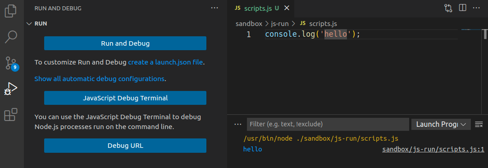
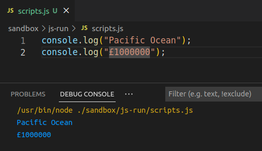

Web Development and User Experience | Coding Sessions | Joseph Muller

[Previous](workshop-7.md) | [All](README.md) | [Next](javascript-values-and-data-types.md)

# JavaScript setup

## JavaScript as a programming language
So far, you've learned about a few different kinds of computer languages.

HTML, as a markup language, lets you formally describe pieces of content like text, images, and video, giving web browsers instructions on the structure and meaning of that content.

CSS, as a stylesheet language, lets you set rules for the display of the content under various circumstances, including some interactive conditions.

JavaScript, as a programming language, offers you wide-ranging flexibility to create computer programs that can create or modify a wide variety of digital objects, most commonly websites and datasets.

You can do lots and lots of things with JavaScript, including altering HTML and CSS in response to user inputs, sending data to a server to be saved, retrieving data from a server to populate webpages, to name a few.

## Running JavaScript

Like HTML and CSS, JavaScript is supported by all major web browsers, so all you need to run JavaScript code is a web browser.

For example, if you open up your inspector pane, navigate to the Console, type this in, and press Enter, the browser will say “Hello” back to you.

```js
console.log('Hello');
```


You can also run JavaScript at the command line and through code editors like VS Code, which has a button for running the currently opened `.js` file.



## Logging things in the console

When a program runs, by default, nothing changes on the screen unless the program says to.

This is different from HTML and CSS, which are by nature presentational, so all we needed to do was open the HTML file in the browser to see the effects of the code?

To *see* a simple JavaScript program run, we need to put explicit output instructions in the program.

The code `console.log();` is a JavaScript function that provides that instruction. Whatever we put in between the parentheses will be output, or printed, to the console that is controlling the program.



It will take a few weeks to understand how this works, but you don't need to understand that yet to use it, and it's very useful!

## Comments in JavaScript

You already know how to write comments for other humans in HTML, using `<!--   -->`, and in CSS, using `/*    */`.

In JavaScript, you can use a double slash (`//`) to comment everything to the right of it, for the rest of the line:

```js
console.log('This will run');
// console.log('This will not run');
console.log('This will run'); // But not this comment
```

You can also use the same syntax as CSS to make block comments:

```js
console.log('This will run');
/*
This is a block comment that
won't run.
Neither will this line.
console.log('or this');
*/
```

## Rights
Copyright Birkbeck, University of London

<a rel="license" href="http://creativecommons.org/licenses/by/4.0/"></a><br />This work is licensed under a <a rel="license" href="http://creativecommons.org/licenses/by/4.0/">Creative Commons Attribution 4.0 International License</a>.
