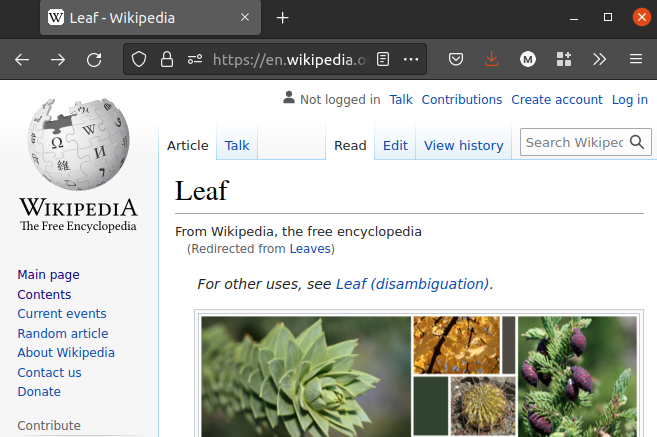

# HTML links, images, and file organization


_"Blue Leaves Background Image" by allthesepieces is licensed under [CC BY-NC-SA 2.0](https://creativecommons.org/licenses/by-nc-sa/2.0/?ref=openverse)._

HTML is *hypertext*, which means one document can link to other documents and data. How does it work?

## The anchor element

The `a` element creates an anchor to attach a URL to a part of the HTML document. It uses the `href` (hypertext reference) attribute to specify the URL.

It looks like this:

```html
    <p>Leaves are falling.</p>
    <p>For more information, see <a href="https://en.wikipedia.org/wiki/Leaf">“Leaf” on Wikipedia</a>.</p>
```

This is rendered visually:


## The image element

The `img` element lets you insert images into your document. With `img`, you use the `src` attribute to point to the path of the image.

```html
    <p>Leaves are falling.</p>
    
```

If you have a lot of attributes, you can add line breaks to line them up and make them easier to read.

This is rendered visually:


Things to notice:

1. With every image, you should always include alternative text inside the `alt` attribute. This is so that screen readers and search engines can understand the content via a text description.
2. You should include the `width` and `height` attributes to tell the browser how much space the image will take up, before it loads, in number of pixels. This prevents other content from jumping when the image loads.
3. There is no closing tag on `img`, because this is a *self-closing* element. It does not wrap text but instead exists for the purpose of the things in the attributes.
4. The value of the `src` attribute is not a complete path. This is because it is a relative path...

## Absolute vs. relative URLs
To use links and images well, you need to understand absolute and relative URLs.

An absolute URL is complete and independent of the source. A relative URL is one that leaves off the parts that are shared with the current document, expecting the browser to fill them in.

Let's say you have two webpages and on each webpage, there is a link in the HTML:

1. In `https://en.wikipedia.org/`
    ```html
    <p>See <a href="https://en.wikipedia.org/wiki/Leaf">“Leaf”</a>.</p>
    ```

2. In `https://www.umich.edu/`
    ```html
    <p>See <a href="https://en.wikipedia.org/wiki/Leaf">“Leaf”</a>.</p>
    ```

This URL is absolute and will always refer to the same thing regardless of the HTML document you put it in.

Both websites will send you to the right place:



*[“Leaf”](https://en.wikipedia.org/wiki/Leaf) on Wikipedia is licensed under [CC BY-SA 3.0](https://creativecommons.org/licenses/by-sa/2.0/?ref=openverse)*

But what if the URLs were shortened, or *relative*?

1. In `https://en.wikipedia.org/`
    ```html
    <p>See <a href="wiki/Leaf">“Leaf”</a>.</p>
    ```

    Computer will try `https://en.wikipedia.org/wiki/Leaf`

    OK

2. In `https://www.umich.edu/`
    ```html
    <p>See <a href="wiki/Leaf">“Leaf”</a>.</p>
    ```

    Computer will try `https://www.umich.edu/wiki/Leaf`

    Not found!

In general, use absolute paths for content on different hosts.

Use relative paths for content on the same host. This way, when you move the whole website to a new host (e.g. from your computer toa server), the paths will still work and you won't have to change them.

## URL fragments

Recall [we said URLs have scheme, a host, and a path](how-the-internet-works.md).

There is another part that we need to know about, the *fragment*. It fits in like this:

```
https://en.wikipedia.org/wiki/Leaf#Morphology
\___/   \______________/ \_______/ \________/
  |            |             |          |
scheme       host           path     fragment
```

Fragments start with a hash (`#`) and come immediately after the path.

They point *within* a document to a particular part. For this to work, they need to have some kind of target explicitly encoded.

If you set the `id` attribute on an element, that element will be accessible through a URL fragment. This is the most common way to make something available as a target.

```html
<h2 id="Morphology">Morphology</h2>
```

Browsers typically handle fragments by moving the viewport to the referenced element. So if you go the URL above, it will not only load the page but scroll you down to the Morphology section of the page.

You can also use fragments to create internal links as `href` attributes inside `anchor` tags. So, if a different part of the page had this link, it would point to the same `h2`.


```html
<a href="#Morphology">Go to section on morphology</a>
```

## Organizing your files

Most presentational websites are organized with subfolders for different content types.

This helps things stay tidy and lets you use consistent relative paths.

Here's an example:

```
index.html
images/
   fallen-leaf.png
   new-leaf.jpg
styles/
   main.css
scripts/
   fancy-button.js
```

You'd import `new-leaf.jpg` in `index.html` this way:

```html

```

## Index.html
What is `index.html`, by the way? It is a conventional name for the home page of the website.

If you specify a path that just points to the folder a website is in, the computer will automatically look for a file named `index.html` at that location:

`https://example.com/foo/bar/` --> `https://example.com/foo/bar/index.html`

## Check your understanding
What's wrong with this? There are four things.

Inside `index.html`:

```html
<section>
    <h2>Spring</h2>
    <p>Leaves are growing.</p>
    
</section>
```

Files:

```
index.html
pictures/
   fallen-leaf.png
   new-leaf.jpg
```

<!--
1. images != pictures
2. src not href
3. jpg not png
4. no alt text
-->

## References

Shaye Howe, “Getting to Know HTML,” *Learn to Code HTML and CSS*, https://learn.shayhowe.com/html-css/getting-to-know-html/.

“The Anchor element,” Mozilla Developer Network, last modified October 10, 2022, [https://developer.mozilla.org/en-US/docs/Web/HTML/Element/a](https://developer.mozilla.org/en-US/docs/Web/HTML/Element/a).

“Dealing with files,” Mozilla Developer Network, last modified September 13, 2022, [https://developer.mozilla.org/en-US/docs/Learn/Getting_started_with_the_web/Dealing_with_files](https://developer.mozilla.org/en-US/docs/Learn/Getting_started_with_the_web/Dealing_with_files).

“URL,” Wikipedia, last upated 2022, https://en.wikipedia.org/wiki/URL.

*HTML: The Living Standard: Edition for Web Developers,* last updated September 28, 2022, https://html.spec.whatwg.org/dev/.

## Rights
Copyright Birkbeck, University of London

<a rel="license" href="http://creativecommons.org/licenses/by/4.0/"></a><br />This work is licensed under a <a rel="license" href="http://creativecommons.org/licenses/by/4.0/">Creative Commons Attribution 4.0 International License</a>.
