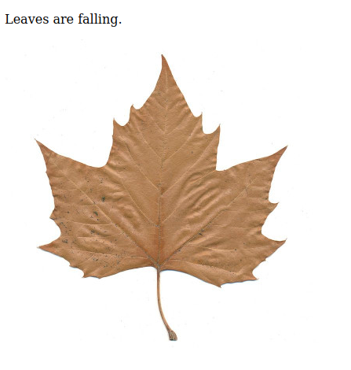

# Images and other files in HTML


_"Blue Leaves Background Image" by allthesepieces is licensed under [CC BY-NC-SA 2.0](https://creativecommons.org/licenses/by-nc-sa/2.0/?ref=openverse)._

HTML structures text, as we have seen. It also structures images, videos, and other graphics.

## Images

Here’s a really boring picture rendered in HTML:



This was made with the `img` element and the `src` attribute, which gives the path of the image.

```html{2}
<p>Leaves are falling.</p>

```

Notice there is no closing tag on `img`. It is a *self-closing* element. It does not “wrap” text but instead exists to load non-textual content.

### Alt text

Whenever you include images in your HTML, you have to think about accessibility.

People who use screen readers rather than looking at a web page need you to include “alternative text” in the HTML for each meaningful image. Alternative text describes the image for someone who cannot see it.

You can provide alt text by writing a description of each image and including it inside the `alt` attribute.

```html{3}

```

Note that alt text does not show up visually, so it’s not the same thing as a caption.

If the image is purely decorative and does not add any meaning, you should include the `alt` attribute but leave the value empty, with `alt=""`.

For example, say we have a link to the university website with a logo.


```html
<a href="https://bbk.ac.uk">
  
  Birkbeck, University of London
</a>
```

Anyone using a screen reader will understand the meaning of the link because of the text “Birkbeck, University of London”, so no alt text is needed inside the `img` element.

### Image width and height

You should generally include the `width` and `height` attributes on each image to tell the browser how much space the image will take up in the number of pixels.

```html{4-5}

```

This allows the browser to set aside a certain space on the screen as soon as it parses the HTML, even before it has opened the image file and loaded the data. This keeps the page from “jumping” if the images are slow to load.

## URLS and file paths

Remember that URLs and paths are made of three parts:

```
https://example.org/images/leaf-small.jpg
\___/   \_________/ \___________________/
  |          |              |    
scheme      host           path  
```

### Relative paths

You may have noticed that the leaf image above did not have a complete URL in `src`

```html
Here’s an image that I am not hosting on my server, 
but I want to include it on this webpage.</p>

```

Or when you are linking to another website:

```html
Check out <a href="https://example.org/projects">my friend’s projects</a>
```

With these paths, the host is different from the HTML document’s host, so you have to tell the computer the full path. Otherwise it will assume it’s the same host.

### Forming good paths

Paths should not include spaces:

```html
 // [!code error]
```

Why? This is an age-old requirement in computing. From the early days, computers tended to read spaces as hard boundaries between things. We want the computers processing our HTML to think of each path as a single thing.

Use dashes to separate words:

```html

```

Why? Why not underscores like `My-Special-Leaf.jpg`? This one has to do with search optimization. Search engines will break apart the path on `-` and process each word as a potential search term.

Paths should use lowercase letters, ideally:

```html

```

Why? It is not a rule, but it helps a lot, because it reduces the possibility of mistakes causing bugs in your code. What if you type an uppercase letter on a file name and a lowercase one in the path? The path will break.

These naming rules apply to all your coding projects, both folder names and file names. Get into the habit of using lowercase letters and dashes only, and you will thank yourself later.

## Organizing your files

Many static websites are organized with subfolders for different content types.

This helps things stay tidy and lets you use consistent relative paths.

```
project
├─ index.html
├─ images
│  └─ fallen-leaf.png
├─ styles
│  └─ main.css
└─ scripts
   └─ fancy-button.js
```

This is not the only way to organize your files.

The only general rule is to group like things with like. If you have
a lot of files of the same kind, whether that’s images, or components,
or style sheets, they should be together in a subfolder.

What is `index.html`, by the way? It is a conventional name for the
entry point to a website. For JavaScript-powered sites, it is often `index.js`.

## Zip files

Because the relations between the files are essential, when you send
or receive a website’s files, you need to do so at the project level.
That way you maintain the exact layout and all the paths still work.

You often cannot upload, download, or attach a folder, but you
can create a ZIP file, which is a container for a bunch of files that can
be moved around and treated like a single file, with the extension `.zip`.

Generally you can make a ZIP like this:

<video controls>
<source src="images/saving-zip-file-homework-2.webm" alt="Creating a zip file on Ubuntu">
</video>

1) Select all the files and folders you want
2) Right-click, then “Send to compressed folder” or “Compress”
3) Name it

## Check your understanding

Is there anything wrong with this website?

Files:

```
├─ index.html
└─ pictures
   └─ Small leaf.jpg
```

Inside `index.html`:

```html
<section>
  <h2>Spring</h2>
  <p>Leaves are growing.</p>
  
</section>
```

<!--
1. images != pictures
2. src not href
3. jpg not png
4. no alt text
5. spaces and capitals in paths
6. wrong host
-->

## References

Shaye Howe, “Getting to Know HTML,” *Learn to Code HTML and CSS*, https://learn.shayhowe.com/html-css/getting-to-know-html/.

“The Anchor element,” Mozilla Developer Network, last modified October 10, 2022, [https://developer.mozilla.org/en-US/docs/Web/HTML/Element/a](https://developer.mozilla.org/en-US/docs/Web/HTML/Element/a).

“Dealing with files,” Mozilla Developer Network, last modified September 13, 2022, [https://developer.mozilla.org/en-US/docs/Learn/Getting_started_with_the_web/Dealing_with_files](https://developer.mozilla.org/en-US/docs/Learn/Getting_started_with_the_web/Dealing_with_files).

“URL,” Wikipedia, last upated 2022, https://en.wikipedia.org/wiki/URL.

*HTML: The Living Standard: Edition for Web Developers,* last updated September 28, 2022, https://html.spec.whatwg.org/dev/.
