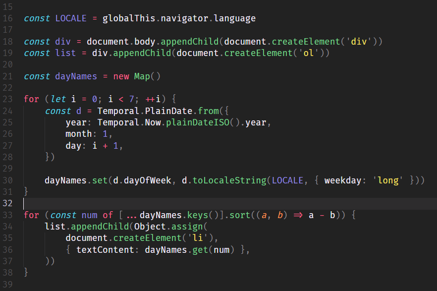

# Introduction to JavaScript


*A scene from Dark Blue by Thomas Palef, in Marijn Haverbeke, chapter 16
of Eloquent JavaScript, 3rd edition.*

## JavaScript as a programming language
So far, you have learned about a few different kinds of computer languages.

::: details Markup language
Lets you formally describe pieces of content like text, images, and video,
giving web browsers instructions on the structure and meaning of that content.
:::

::: details Stylesheet language
Lets you set rules for the display of the content under various circumstances,
including some interactive conditions.
:::

::: details Command language
Lets you issue text commands to an operating system or application in order to
display information, modify files, or run programs.
:::

Today we are starting with a fourth kind:

::: details Programming language
Lets you write programs that can create and modify many kinds of digital
objects, including documents like HTML and CSS as well as datasets, and that
can listen for and interpret many kinds of user inputs, which forms the basis
of an interactive user experience.
:::



## Brief history of JavaScript

### 1990s

- Created during the chaos of the browser wars between Netscape and Microsoft
  Internet Explorer

- Marketed as similar to Java despite being a different language (the legal name
  is ECMAScript because “Java” is a trademark of Oracle)

### 2000s

- Grew in popularity, with new design patterns letting you change part of
  a webpage, without reloading the whole HTML document

- Implemented in new browsers including Mozilla Firefox, Google Chrome, and
  Apple Safari

- Language design still poor, because browser vendors did not jointly create
  common standards until 2009, creating version 5 of the language

- jQuery library filled the usability gap

- Node.js engine created to run JavaScript outside web browser

### 2010s

- Commonly used via component libraries like Bootstrap

- Browser vendors worked together on major usability improvements, culminating
  in 2015 with version 6 (called “ES6”, short for “ECMAScript 6”)

- Rise of JavaScript-first web application frameworks like React, Angular, and
  Vue

- Advent of TypeScript, an extended version of JavaScript that adds usability and
  robustness in large applications

### 2020s

- Consistent yearly updates to language, with careful cross-browser
  coordination

- Back to basics movement, with new trends like Web Components, HTMX,
  and lightweight frameworks like Alpine

## Running JavaScript

Like HTML and CSS, JavaScript is supported by all major web browsers, so all
you need to run JavaScript code is a web browser.

For example, if you open up your inspector pane, navigate to the Console, type
this in, and press Enter, the browser will say “Hello” back to you.

```js
console.log('Hello')
```

::: tip TRY IT
Open your browser console, paste the above code, and press Enter.
:::

You can also run JavaScript outside the browser, using Node.js as
a command-line tool.
[Node can be downloaded and installed for free](https://nodejs.org/).

First save your JavaScript code in a text file ending in ‘.js’ [like this
one](https://github.com/Birkbeck2/web-development/tree/main/public/sandbox/js-console-log/):

<<< @/public/sandbox/js-console-log/log-script.js{js}

::: tip TRY IT
With Mac Terminal or Windows Git Bash opened to the directory containing
your JS file, run the command `node log-script.js`.
:::

## Logging things in the console

When a JavaScript program runs, by default, nothing changes on the screen unless the
program says to.

This is different from HTML and CSS, which are by nature presentational, so all
we needed to do was open the HTML file in the browser to see the effects of the
code.

To *see* a simple JavaScript program run, we need to put explicit output
instructions in the program.

The code `console.log()` is a JavaScript function that provides that
instruction. Whatever we put in between the parentheses will be logged, or
output, to the console that is controlling the program.

This is useful in debugging your code.

::: tip TRY IT
Log “Pacific Ocean” to the console by modifying the JS file
above. Then log “£1000000”.
:::

It will take a few weeks to understand the syntax of `console.log()`, but you
don't need to understand that yet to use it, and it's very useful!

## Comments in JavaScript

You already know how to write comments for other humans in HTML, 
using `<!-- -->`, and in CSS, using `/*    */`.

In JavaScript, you can use a double slash (`//`) to comment everything to the
right of it, for the rest of the line:

<<< @/public/sandbox/js-comments/comment-script.js#linecomment{js}

You can also use the same syntax as CSS to make block comments:

<<< @/public/sandbox/js-comments/comment-script.js#blockcomment{js}

::: tip TRY IT
Run
[comment-script.js](https://github.com/Birkbeck2/web-development/tree/main/public/sandbox/js-console-log/)
a few times with modifications to experiment with comments.
:::

## Check your understanding

1. How would you describe the environment out of which JavaScript first
   emerged?

2. How does Java relate to JavaScript?

3. What were some big changes in the JavaScript ecosystem in the 2010s?

4. What are the methods for running JavaScript code?

5. True or false: Logging something to the console also changes the website
   the JavaScript is running on.
