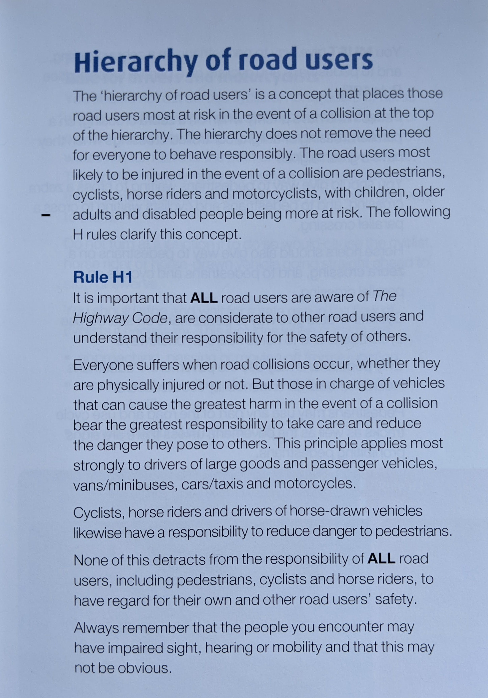
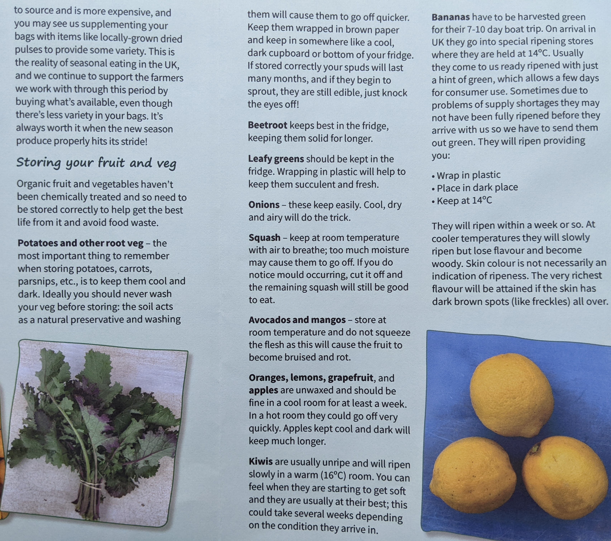
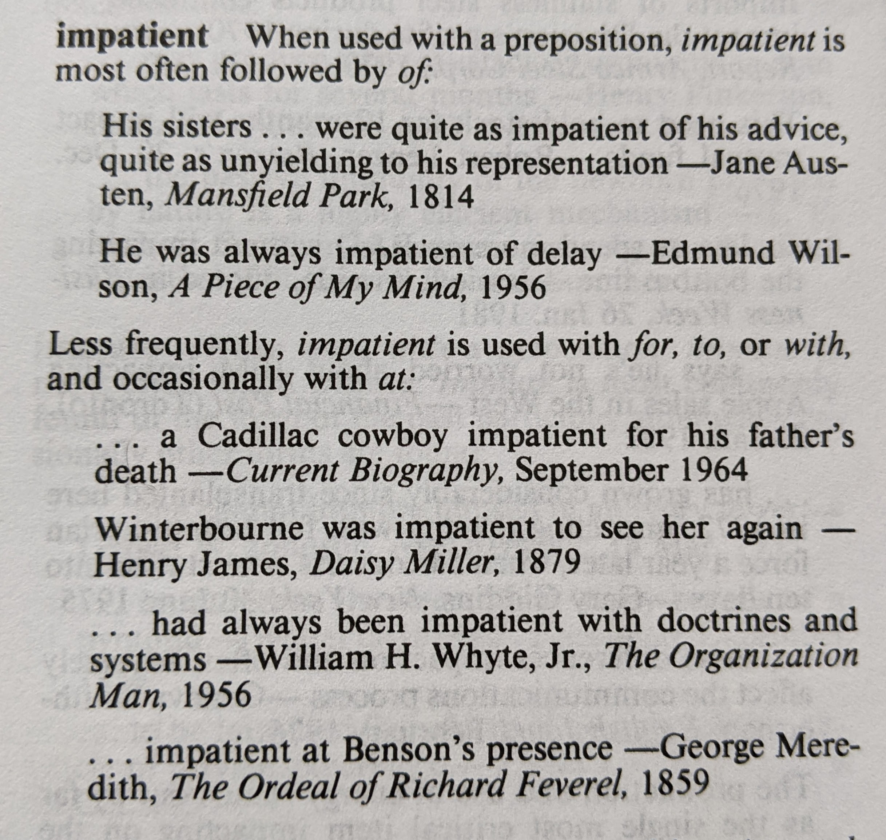

Web Development and User Experience | Coding Session 1 | Joseph Muller

[Previous](code-editors-and-environments.md) | [All](README.md)

# Coding workshop 1

## About workshops

Coding is a skill in addition to being a knowledge base. For that reason, you have to practice it regularly to gain proficiency.

The coding workshops are a chance to practice the new pieces of HTML, CSS, or JS you learned that day in class, with the support of teachers and peers nearby.

When you finish a workshop, you may be able to submit your work on Moodle for feedback, though not every week, and workshop submissions generally don't count toward assessment for the class. Check Moodle for a submission link.

## Set up your code editor and environment

1. Install or re-install your favorite code editor on your computer. This could be VS Code or one you already use and like.

    If you are working on a lab computer, you may not be able to install software. If this happens, find and open Notepad.

2. Create a workshop folder where you can keep your workshop files for this module. Not sure where to put it? You can put it on your Desktop for now. The file path might look something like this:

    `\C:\Users\username\coding\workshop-1\`

    Bonus: you may be able to open this folder in your code editor so that it displays in the side bar, even before you put any files in it. This will allow you to work withou the file explorer, for the most part.

3. Open up your internet browser and arrange it so that you can see it alongside your code editor (and file explorer if needed).

## Mark up a document with HTML

4. Using your code editor, make a new file named “hierarchy-of-road-users.html” and save it in your workshop file.

5. Copy the text from [“Hierarchy of road users (TXT)”](text/hierarchy-of-road-users.txt) and paste it into your new file.

6. Using your knowledge of HTML tags, elements, nesting, and page structure, mark up this excerpt from *The Highway Code*.

## Check and debug the HTML

7. When you are ready to check your work, open the file in your web browser. You can do this with your file explorer, your code editor, or your browser (by typing `file:///` and then the exact path in the URL bar). Explore different ways to find the easiest for you.

8. Check the visual appearance of the page, or use your screen reader to listen to the result and navigate around it. Does it look or sound right? Did the browser understand what you wanted it to do with the text?

    

    *Crown copyright 2022*

9. If anything isn't quite right, debug the HTML by trying to identify the source of the problem. Open the developer tools to inspect the HTML. Did the browser change your markup when it interpreted it? Is something missing? Why did the computer think what it thought when it read your document?

10. Fix any issues by changing the HTML file in the code editor, saving the file, and refreshing the browser. Do you see your changes take effect?

## Mark up another document
11. Repeat steps 4-11 with another document, [“Storing your fruit and veg (TXT)”](text/storing-your-fruit-and-veg.txt).

    Does it look similar to this?

    

    *Copyright OrganicLea 2022*

## Do some peer review
12. Get in a group of two or three with other students. Take turns sharing your documents about road users or storing vegetables. Questions for discussion:

    - What did you find easy? What did you find hard? Why?
    - What are the similarities or differences in the way you marked up the document?
    - Give some feedback to each other. Here are some feedback templates:
        - “I like...”
        - “I wish...”
        - “What if...?”

## Inspect three kinds of websites
13. Go to a website of your choosing in a new tab. Here are some kinds of websites to jog your memory:

    - news
    - shopping
    - social media
    - search engine
    - informational (e.g. Wikipedia)
    - organizational (e.g. Birkbeck, University of London or Doctors Without Borders)

14. Choose a part of the page to inspect and find the precise code behind that part of the page in the developer tools inspector pane.

15. Using the inspector pane, try to change something about that part of the page. You can add or remove text, add elements, move elements around, etc.

16. Look around the page to identify a new element of HTML that you haven't seen before. Can you understand what it's doing, or why it's there?

    Hint: look in the `body`, not the `head`, since body elements are often easier to understand.

17. Repeat steps 13-16 for two other kinds of websites.

## Mark up a tricky document (if time)
18. Repeat steps 4-11 with another document, a usage dictionary entry for [“impatient (TXT)”](text/impatient.txt).

    Does it look similar to this?

    

    *Copyright Merriam-Webster, 1994*

## Teach yourself something new (if time)
19. Modify one of the HTML documents you've marked up with a new element of your choosing, adding fake or made-up text if you need. You could try to use one of the new elements you found on the websites you inspected above. Or you could choose a new element. In either case, you can use [HTML elements reference](https://developer.mozilla.org/en-US/docs/Web/HTML/Element) to learn about new elements.

    OR, if (and only if) you already know something about CSS, try to fix one of the styling things in our workshop documents you noticed you couldn't reproduce with HTML alone.

## Credits

The documents referenced in this workshop are partially reproduced in this repository for [teaching purposes only](https://www.gov.uk/guidance/exceptions-to-copyright).

“Hierarchy of road users,” in *The Official Highway Code*, 17th ed. (Driver and Vehicle Standards Agency for the Department for Transport, 2022), 5. Crown copyright 2022, licensed under the terms of the [Open Government Licence v3.0](https://www.nationalarchives.gov.uk/doc/open-government-licence/version/3/).

“Storing your fruit and veg,” in *Welcome to OrganicLea’s box scheme: Fresh, local, organic fruit and veg in Waltham Forest* (OrganicLea).

“impatient” in *Merriam-Webster’s Dictionary of English Usage* (Springfield, MA: Merriam-Webster, 1994).

## Rights
Copyright Birkbeck, University of London

 This work is licensed under a <a rel="license" href="http://creativecommons.org/licenses/by/4.0/">Creative Commons Attribution 4.0 International License</a>.
