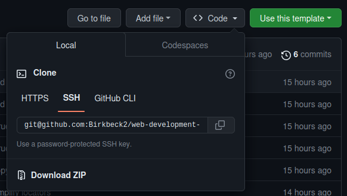

# Workshop on Accessibility

In this workshop we will attempt to put into practice this finding (Mankoff et
al):

<blockquote class="text-2xl">
  “Multiple evaluators using a combination of a screen reader and monitor
  were most consistently effective at finding both empirical and WCAG
  accessibility problems.”
</blockquote>

## Getting set up

### “Multiple evaluators”

Developers sometimes find it helpful to pair up with each other while they
are writing code. Optimistically, “pair programming” offers:

- half the feeling of banging your head against the machine

- double the chances of getting unstuck quickly

- one person can look up something while the other writes code

- you might learn new coding patterns because their brain is different from yours

So, we will ask you go get into pairs.

::: info
You will also be able to submit the homework together with your partner. You’ll only have
to submit one website, and it will give you both credit.
:::

### “Screen reader and monitor”

Try to form pairs where: 

- At least one person in each pair will have headphones they can listen to and
  a computer with a screen reader on it. Common ones include
  [NVDA](https://www.nvaccess.org/),
  [Apple Voiceover](https://support.apple.com/en-gb/guide/voiceover/welcome/mac), and
  [JAWS (costs money)](https://www.freedomscientific.com/products/software/jaws/).

- At least one person will have a screen they can inspect visually

- Finally, because automatic tools have improved a lot since 2005, when the
  Mankoff study was done, at least one person will have a browser tool or
  plugin that checks accessibility. Common ones include
  [WAVE](https://wave.webaim.org/),
  [Lighthouse](https://developer.chrome.com/docs/lighthouse/), and
  [Axe (costs money)](https://www.deque.com/get-started-axe-devtools-browser-extension/).

## Improve the design of an inaccessible website

Your main workshop task is to improve the accessibility of “Medical
Mysteries Club”, a fake landing page created by
[web.dev](https://web.dev/learn/accessibility)
and made intentionally inaccessible.

1. Download the starter code from
   [inaccessible-landing-page](https://github.com/Birkbeck2/inaccessible-landing-page).

   Download it as a zip file (or clone it if you know Git).

   

2. Unzip or extract the files from the zip and open them in your editor.

## Check it with automatic tools

3. As a first step, please run an automatic accessibility checker. Modify the
   HTML or CSS to bring it up to accessible design standards.

::: info
The homework autograder for this session uses a free CLI version of Axe, so you
can submit a working version of the homework on Gradescope.eu to see Axe errors.
:::

## Check it with mainstream technology

4. Once your checker is returning a good score, try manually inspecting the page,
   comparing it against what you know of WCAG, accessible design patterns from
   the lecture, semantic HTML, and responsive CSS. Are there any further
   improvements you can make?

## Check it with assistive technology

5. Finally, please examine it using a screen reader. What do you notice about the 
   usability that you missed with the checker and mainstream tech inspection?

## References

Fisher, Carie, Alexandra White, and Rachel Andrew. “Learn Accessibility.”
web.dev. Accessed November 14, 2023. https://web.dev/learn/accessibility.

Mankoff, Jennifer, Holly Fait, and Tu Tran. “Is Your Web Page Accessible?
A Comparative Study of Methods for Assessing Web Page Accessibility for
the Blind.” In Proceedings of the SIGCHI Conference on Human Factors in
Computing Systems, 41–50. CHI ’05. New York, NY, USA: Association for
Computing Machinery, 2005. https://doi.org/10.1145/1054972.1054979.
